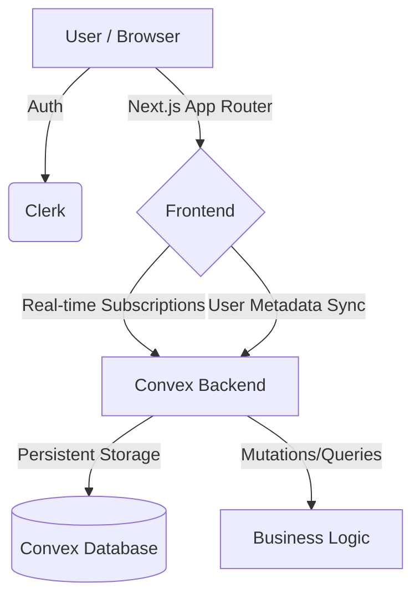

# ChatPulse | Premium Real-time One-to-One Chat

ChatPulse is a high-performance, aesthetically pleasing real-time chat application built for modern connectivity. It leverages the power of Next.js 15, Convex, and Clerk to provide a seamless messaging experience.

## 📐 System Architecture



### Flow Breakdown:
1. **Authentication**: Handled by Clerk. User identity is protected at the Edge via middleware.
2. **Real-time Engine**: Convex manages state using a subscription model. Any change in the database (new message, typing status) is instantly pushed to the UI.
3. **Database**: Managed by Convex (Serverless database) with custom indexes for high-speed lookups.

---

## ✨ Features

- **Real-time Messaging**: Instant delivery and reactive updates.
- **Dynamic User Search**: Live person discovery with filtering.
- **Typing Indicators**: Visual feedback when someone is replying.
- **Unread Counters**: Real-time badges for missed messages.
- **Smart Auto-Scroll**: Intelligent chat window management.
- **Premium UI/UX**: 
  - Framer Motion animations.
  - Dark-mode optimized.
  - Responsive Sidebar/Panel design.
  - High-end typography (Inter font).

---

## 🛠️ Tech Stack

- **Frontend**: Next.js 15 (App Router, Turbopack)
- **Backend/Database**: Convex (Serverless)
- **Authentication**: Clerk
- **Styling**: Tailwind CSS 4
- **Components**: Radix UI + Custom shadcn-like components
- **Animations**: Framer Motion
- **Icons**: Lucide React

---

## 🚀 Deployment (Render / Vercel)

### Backend (Convex)
1. Go to [Convex Dashboard](https://dashboard.convex.dev/).
2. Create a new project.
3. Copy your `CONVEX_DEPLOYMENT` and `NEXT_PUBLIC_CONVEX_URL`.

### Frontend
1. Connect your GitHub repository to Render or Vercel.
2. Add the following Environment Variables:
   - `NEXT_PUBLIC_CLERK_PUBLISHABLE_KEY`
   - `CLERK_SECRET_KEY`
   - `NEXT_PUBLIC_CONVEX_URL`
3. Build Command: `npm run build`
4. Start Command: `npm run start`

---

## 🛠️ Local Development

1. **Clone the repository**:
```bash
git clone https://github.com/ShreyashPatil530/One-To-One-Real-time-Chat-App.git
```

2. **Install dependencies**:
```bash
npm install
```

3. **Setup environment**:
Create `.env.local` with your Clerk and Convex keys.

4. **Run the backend**:
```bash
npx convex dev
```

5. **Run the application**:
```bash
npm run dev
```

---

## 📝 License
MIT License - open for customization and improvement.
